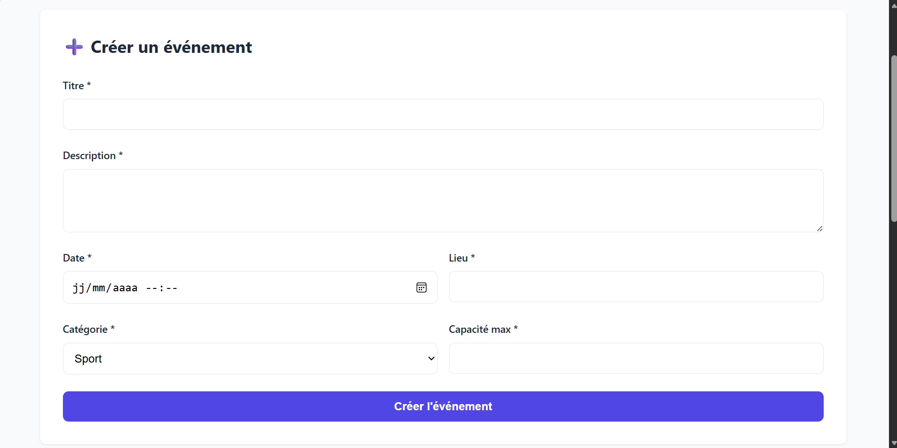
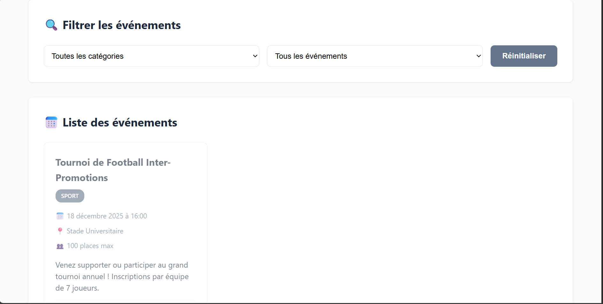
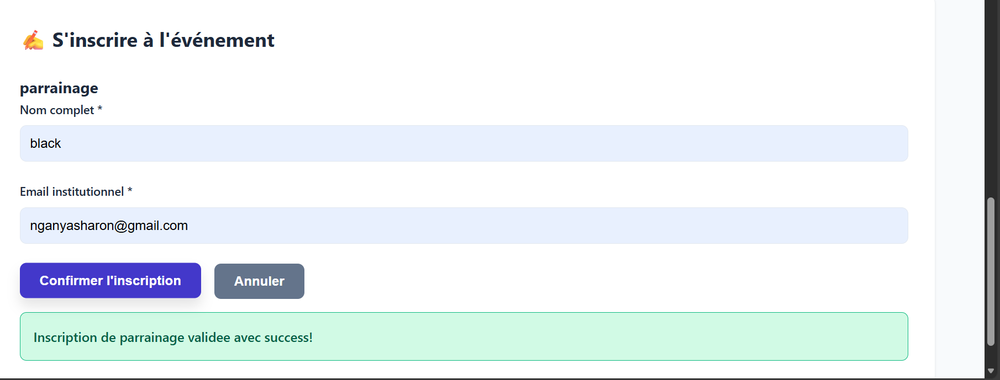

🎓 Projet académique réalisé dans le cadre d'un cours de typescript.
# 🎉 Gestion d'Événements

> Application web de gestion d'événements développée en TypeScript pur, sans framework

# 📋 Description

Cette application web permet de créer, afficher et gérer des événements, ainsi que de gérer les inscriptions des utilisateurs à ces événements. 

Le projet met en pratique :
- ✅ Programmation Orientée Objet (POO) en TypeScript
- ✅ Architecture en couches (Models, Repositories, Services, UI)
- ✅ Séparation stricte des responsabilités
- ✅ Gestion de données en mémoire (tableaux structurés)
- ✅ Interface HTML/CSS responsive sans framework

# 📸 Capture d'ecran
-
-
-

# ✨ Fonctionnalités

     📅 Gestion des événements
    - Créer un événement avec toutes les informations nécessaires
    - Afficher tous les événements sous forme de cartes
    - Filtrer par catégorie
    - Filtrer par période (à venir / passés)
    - Voir les places restantes en temps réel

     👤 Gestion des utilisateurs
    - Inscription avec nom et email institutionnel
    - Validation du format email (@saintjeaningenieur.org)
    - Prévention des doublons (email unique)

     ✍️ Gestion des inscriptions
    - S'inscrire à un événement disponible
    - Règles métier strictes :
    - ❌ Impossible si événement complet
    - ❌ Impossible si événement passé
    - ❌ Impossible si déjà inscrit
    - Mise à jour automatique des places restantes

# 🛠️ Technologies utilisées

-TypeScript 
-HTML5 
-CSS3 
-Node.js 
-npm 

Aucun framework utilisé (pas de React, Angular, Vue.js)

# 📦 Prérequis

Avant de commencer, assurez-vous d'avoir installé :

- Node.js (version 18 ou supérieure) - [Télécharger](https://nodejs.org/)
- npm (inclus avec Node.js)
- Un éditeur de code 
- Un navigateur moderne 

Vérifiez vos versions :
`bash
node --version  # doit afficher v18.x.x ou plus
npm --version   # doit afficher 9.x.x ou plus
🚀 Installation
1. Cloner le projet
git clone https://github.com/votre-username/event-management-app.git
cd event-management-app
2. Installer les dépendances
npm install
Cela installe TypeScript et les outils nécessaires.
3. Compiler le TypeScript
npm run build
Les fichiers JavaScript sont générés dans le dossier dist/.
▶️ Utilisation
Méthode 1 : Avec serveur local (recommandé)
# Installer http-server (une seule fois)
npm install --save-dev http-server

# Ajouter dans package.json > scripts :
# "serve": "http-server . -p 8080"

# Lancer le serveur
npm run serve
Ouvrir dans le navigateur : http://localhost:8080/public/index.html
Méthode 2 : Ouverture directe
Double-cliquez sur public/index.html ou :
# macOS
open public/index.html

# Linux
xdg-open public/index.html

# Windows
start public/index.html
⚠️ Note : La méthode 2 peut causer des erreurs CORS. Préférez la méthode 1.
📂 Structure du projet
event-app/
│
├── src/                          # Code source TypeScript
│   ├── models/                   # 📦 Interfaces (entités de données)
│   │   ├── Event.interface.ts
│   │   ├── User.interface.ts
│   │   └── Inscription.interface.ts
│   │
│   ├── repositories/             # 💾 Gestion des données (CRUD)
│   │   ├── EventRepository.ts
│   │   ├── UserRepository.ts
│   │   └── InscriptionRepository.ts
│   │
│   ├── services/                 # 🔧 Logique métier
│   │   ├── EventService.ts
│   │   ├── UserService.ts
│   │   └── InscriptionService.ts
│   │
│   ├── ui/                       # 🎨 Interface utilisateur
│   │   ├── EventUI.ts
│   │   ├── InscriptionUI.ts
│   │   ├── FilterUI.ts
│   │   └── AppUI.ts
│   │
│   ├── utils/                    # 🛠️ Utilitaires
│   │   ├── idGenerator.ts
│   │   └── validators.ts
│   │
│   ├── styles/                   # 🎨 Styles CSS
│   │   └── main.css
│   │
│   └── main.ts                   # 🚀 Point d'entrée
│
├── public/                       # Fichiers publics
│   └── index.html
│
├── dist/                         # 📦 Fichiers JavaScript compilés (généré)
├── node_modules/                 # 📚 Dépendances npm (généré)
│
├── .gitignore                    # Fichiers exclus de Git
├── package.json                  # Configuration npm
├── tsconfig.json                 # Configuration TypeScript
└── README.md                     # Documentation (ce fichier)

🏗️ Architecture
Le projet suit une architecture en couches pour une séparation stricte des responsabilités :
1️⃣ Couche Modèles (models/)
Rôle : Définir les structures de données (interfaces TypeScript)
Events : titre, date, lieu, catégorie, capacité
User : nom, email
Inscription : lie un utilisateur à un événement
Principe : Entités passives, aucune logique.
2️⃣ Couche Repositories (repositories/)
Rôle : Gérer le stockage en mémoire (CRUD basique)
Méthodes typiques :
add() : Ajouter
getAll() : Lire tout
findById() : Chercher par ID
delete() : Supprimer
Principe : Aucune logique métier, juste manipulation de tableaux.
3️⃣ Couche Services (services/)
Rôle : Implémenter la logique métier
Exemples de règles :
Valider l'email institutionnel (@univ-exemple.fr)
Empêcher l'inscription si événement complet
Empêcher l'inscription si événement passé
Vérifier les doublons
Principe : Utilise les repositories, applique les règles.
4️⃣ Couche UI (ui/)
Rôle : Gérer l'interface utilisateur
Modules :
EventsUi : Formulaire création + affichage des cartes
InscriptionUi : Formulaire d'inscription
FilterUi : Filtres interactifs
AppUi : Orchestrateur (coordonne les 3 modules)
Principe : Écoute les événements DOM, appelle les services, met à jour l'affichage.
🔄 Flux de données
Utilisateur → UI → Services → Repositories → Données en mémoire
                     ↓
                 Validation
                 Règles métier
Exemple concret : Inscription à un événement
1. User clique "S'inscrire"          → EventUI
2. Affiche le formulaire             → InscriptionUI
3. User remplit nom + email          → InscriptionUI
4. Soumission du formulaire          → InscriptionUI.gererSoumission()
5. Création/récupération utilisateur → UserService.obtenirOuCreer()
6. Validation email institutionnel   → validators.validerEmail()
7. Vérifications règles métier       → InscriptionService.inscrire()
   - Événement existe ?
   - Événement passé ?
   - Déjà inscrit ?
   - Complet ?
8. Ajout dans le repository          → InscriptionRepository.add()
9. Affichage message succès          → InscriptionUI.afficherMessage()
10. Rafraîchissement de la liste     → EventUI.afficherEvenements()
🧪 Exemples d'utilisation
Créer un événement
Remplir le formulaire "Créer un événement"
Choisir une date dans le futur
Sélectionner une catégorie
Définir la capacité maximale
Cliquer sur "Créer l'événement"
✅ Résultat : L'événement apparaît dans la liste
S'inscrire à un événement
Cliquer sur "S'inscrire" sous un événement disponible
Remplir nom et email institutionnel (@univ-exemple.fr)
Cliquer sur "Confirmer l'inscription"
✅ Résultat :
Message de confirmation
Places restantes diminuent
Impossible de s'inscrire deux fois
Filtrer les événements
Par catégorie :
Sélectionner "Sport" → Affiche uniquement les événements sportifs
Par date :
Sélectionner "À venir" → Masque les événements passés
Sélectionner "Passés" → Affiche uniquement les événements terminés
Réinitialiser :
Cliquer sur "Réinitialiser" → Affiche tous les événements
🎨 Personnalisation
Changer le domaine email institutionnel
Dans src/services/UserService.ts, ligne 12 :
private readonly DOMAINE_INSTITUTIONNEL = 'votre-domaine.fr';
Modifier les couleurs
Dans src/styles/main.css, variables CSS (lignes 2-12) :
:root {
  --primary-color: #4f46e5;  /* Couleur principale */
  --success-color: #10b981;  /* Couleur succès */
  --error-color: #ef4444;    /* Couleur erreur */
  /* ... */
}
Ajouter une catégorie
Dans src/models/Event.interface.ts :
categorie: 'conférence' | 'sport' | 'atelier' | 'culture' | 'autre';
Dans public/index.html, ajouter dans les <select> :
<option value="culture">Culture</option>

🐛 Dépannage
❌ Erreur : Cannot use import statement
Cause : Oubli de type="module" dans le script
Solution : Vérifier dans index.html :

❌ Erreur : Module not found
Cause : Extensions .js manquantes dans les imports TypeScript
Solution : Tous les imports doivent finir par .js :
import { Event } from './models/Event.interface.js'; // ✅
❌ Les styles CSS ne s'appliquent pas
Cause : Chemin incorrect dans <link>
Solution : Vérifier le chemin relatif dans index.html :
<link rel="stylesheet" href="/styles/main.css">
❌ Page blanche dans le navigateur
Solutions :
Ouvrir la console (F12) pour voir les erreurs
Vérifier que npm run build s'est exécuté sans erreur
Vérifier que le dossier dist/ contient des fichiers .js
Utiliser un serveur HTTP plutôt que l'ouverture directe

📚 Commandes npm
Commande
Description
npm install
Installer les dépendances
npm run black
Compiler TypeScript → JavaScript
npm run black-watch
Compiler en continu (détecte les changements)
npm start
Compiler + Exécuter
npm run black-dev
Mode développement (recompilation auto)
npm run serve
Lancer un serveur HTTP local

🎓 Concepts clés appliqués

1. Programmation Orientée Objet (POO)
Classes avec constructeurs
Encapsulation (propriétés privées)
Méthodes d'instance
Injection de dépendances
2. Séparation des responsabilités (SoC)
Chaque classe a un rôle unique et précis
Pas de logique métier dans l'UI
Pas d'accès direct aux repositories depuis l'UI
3. Typage statique avec TypeScript
Interfaces pour les structures de données
Types stricts (pas de any)
Autocomplétion et détection d'erreurs
4. Architecture modulaire
Code organisé en modules réutilisables
Imports/exports ES6
Facilite les tests et la maintenance
5. Validation et sécurité
Validation côté client (email, dates, capacité)
Règles métier strictes
Messages d'erreur explicites

👨‍💻 Auteur
Votre Nom
🎓 NGANYA TCHAKOUNTE SHARON KLARKY EN LICENCE EN CONCEPTION ET DEVELOPPEMENT D APPLICATION POUR L ECONOMIE NUMERIQUE
📧 Email : sharon.nganya@saintjeaningenieur.org
💼 LinkedIn :
🐙 GitHub : klarkyTchakounte
Ce projet est sous licence MIT - voir le fichier LICENSE pour plus de détails.
👨‍🏫 [Nom du professeur] : Kinkeu Daniel
🎨 Inspiration design : Dribbble
🔮 Améliorations futures
[ ] Persistance des données (MySql,postgreSql)
